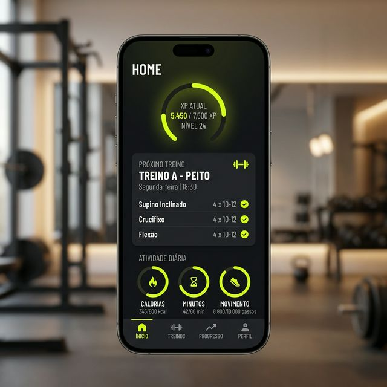
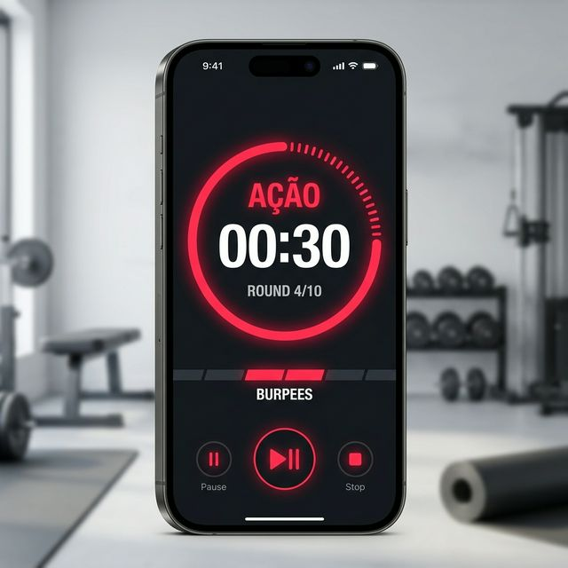
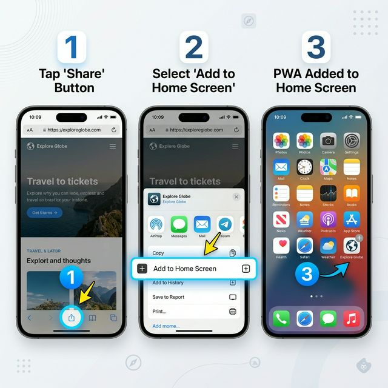
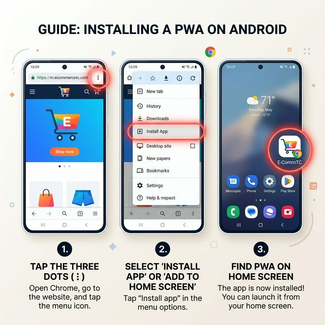
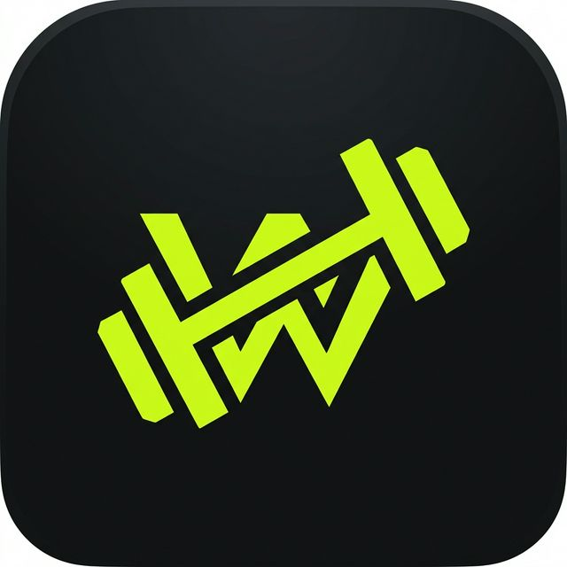

# 🏋️‍♂️ WorkoutApp: Sua Jornada Fitness, Gamificada.

Transforme seu treino em uma experiência épica. O WorkoutApp não é apenas um rastreador de exercícios; é o seu parceiro de evolução pessoal, onde cada repetição conta para o seu nível global.

---

## 📱 Visão Geral

O **WorkoutApp** é um PWA (Progressive Web App) moderno, desenhado com uma estética de RPG e foco em performance. Ele foi construído para quem leva o treino a sério, mas não abre mão da praticidade e da diversão de subir de nível.

  
  

---

## 📲 Como Instalar o App (Passo a Passo)

Como o WorkoutApp é um PWA, você não precisa da App Store ou Google Play. Instale direto do seu navegador para ter uma experiência de tela cheia e notificações.

### 🍏 Para iPhone (iOS)
Use o **Safari** para acessar o app e siga estes passos:

  

1. Toque no botão de **Compartilhar** (ícone do meio na barra inferior).
2. Role para baixo e selecione **"Adicionar à Tela de Início"**.
3. Confirme o nome e toque em **"Adicionar"**. O ícone aparecerá instantaneamente na sua tela!

---

### 🤖 Para Android
Use o **Google Chrome** para acessar o app e siga estes passos:

  

1. Toque nos **três pontos (⋮)** no canto superior direito do Chrome.
2. Localize e toque em **"Instalar Aplicativo"** ou **"Adicionar à Tela Inicial"**.
3. Aguarde o download e confirme. Pronto! Agora o app se comporta como um nativo.

---

## 🔥 Funcionalidades que Vão te Impressionar

### 📸 Importação de Ficha via IA
Esqueça o papel e a caneta. Basta tirar uma foto da sua ficha de treino e nossa inteligência artificial processa tudo instantaneamente.

### 🎮 Gamificação Real (Level Up)
Seu esforço físico se torna progresso digital. Ganhe XP, suba de nível e desbloqueie títulos lendários.

### ⏱️ Cardio & HIIT Inteligente
Um cronômetro que realmente funciona no mundo real, resistente ao background do celular e com integração Bluetooth.

---

## 🛠️ Tecnologias de Ponta

Nosso App utiliza o que há de mais moderno no desenvolvimento web:
- **Next.js 14**: Carregamento ultra-rápido.
- **Supabase Realtime**: Sincronização instantânea na nuvem.
- **Google Gemini Pro**: IA para visão computacional.
- **Web Bluetooth**: Integração com cintas cardíacas.

---

## 👥 Contribuição e Feedback

Este é um projeto feito de quem treina para quem treina. Se você tem sugestões ou encontrou algum bug, abra uma issue no nosso [repositório oficial](https://github.com/eldolucio/workout-app).

---

  
<b>"Não pare quando estiver cansado, pare quando terminar."</b>

  

